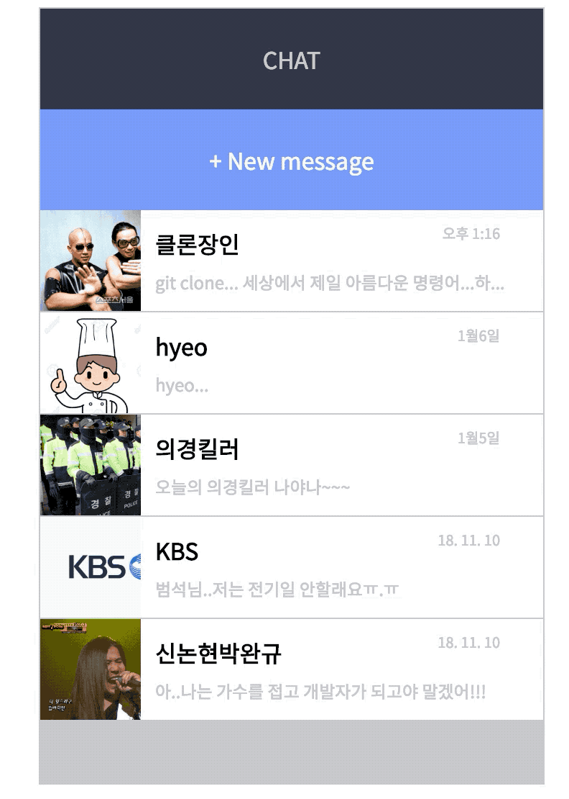

# Fake Chat Application

React & Redux를 이용하여 만든 가짜 채팅 애플리케이션 입니다.



## Setup

Install dependencies

```sh
$ yarn install (or npm install)
```

## Development

```sh
$ yarn start (or npm start)
# visit http://localhost:3000
```

## Features

* 채팅방 목록에서 채팅을 하고자 하는 사람을 선택하면, 해당 사람과 채팅할 수 있는 화면이 표시됩니다.
* 채팅 화면에서 메시지를 입력하면 채팅화면에 표시됩니다. 초기 메시지는 임의로 구성했습니다.
* 일반적인 채팅 어플리케이션 기준으로 구현했습니다.

## Skills
* React
* Redux
* React Router
